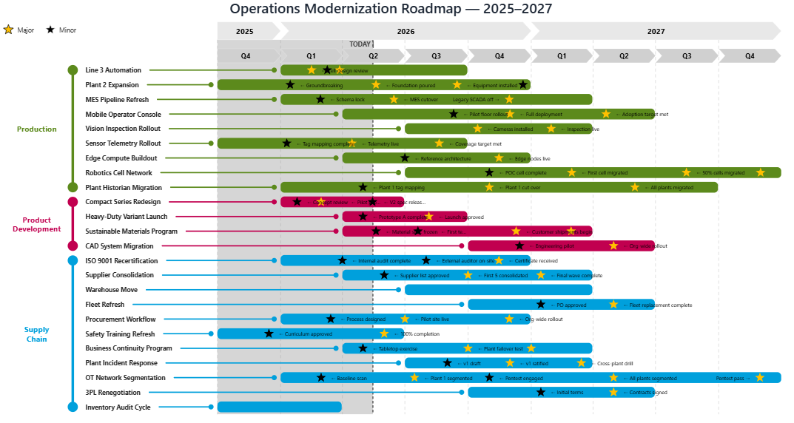

# Reporting Gantt

**A Power BI custom visual for portfolio timelines, roadmaps, and
multi-track project Gantts — built for the people who actually have to
make these dashboards work.**

---

## What this is

Power BI Desktop ships with a built-in Gantt visual that's barely usable
beyond simple cases. The community visuals on AppSource have their own
gaps. If you're trying to build an executive roadmap, a portfolio
status view, or a multi-program Gantt that actually answers business
questions, you spend more time fighting the tools than communicating
the data.

Reporting Gantt is that visual built right. It's free to use, including
in commercial reports for your work or your clients.

## Features

- **Activity swim lanes** with per-area colors that scale beyond 8 lanes
  (PBI's default Gantt caps at 8; lanes 9+ become indistinguishable grey)
- **Per-area color customization** via the Format Pane — unlimited
  cardinality (256 lanes), drag-to-resize swim lane region, label
  truncation with ellipsis
- **Chevron-style time axis** with year / quarter / month / week
  granularities and configurable gridlines
- **Milestone markers** with conditional labels, per-type icon + color
  + size, automatic collision detection and truncation
- **Activity health indicators** with per-value icon binding (warning,
  blocked, paused, off-track, on-track) — visible at a glance across
  the full timeline
- **Baseline vs. actual tracking** with glide-path visualization —
  variance escalation thresholds, slip categorization, MS Project
  Tracking Gantt-style visuals
- **Filter sidebar** with pinnable dimensions, drag-to-reorder,
  multiple display widgets (pills, dropdowns, search chips, range
  slider), drag-to-resize panel width
- **Activity inspector** with slide-out details — milestones gallery,
  metadata fields, owner / status / external URL surfacing
- **Dual-region layout** with a sortable table region below the Gantt
  for tabular drill-down
- **Persistent user state** — splitter ratio, hidden region, sort orders,
  filter selections, column widths all survive report republish
- **Read-only + Studio Mode** awareness — visual respects view-only
  contexts; interactive scheduling layer (in development)
- **Custom theming** with accent color picker for filter panel chrome

## Install

### From this repository

1. Download the latest `.pbiviz` file from the
   [Releases page](https://github.com/DanRider/PBI-Reporting-Gantt/releases).
2. In Power BI Desktop, click the three-dot menu on the **Visualizations**
   panel → **Get more visuals** → **Import a visual from a file**.
3. Select the `.pbiviz` file you downloaded.
4. The visual now appears in your Visualizations panel as **Reporting
   Gantt**.

### From AppSource

Coming soon (pending Microsoft AppSource certification).

## Quick start

The repository includes a `demo/PBI-Reporting-Gantt-v3.0.5.0.pbix` file with sample data
already bound to the visual's data roles. Open it to see Reporting
Gantt in action with a populated roadmap.

For your own data, see the format-pane documentation in
[`docs/format-pane/`](docs/format-pane/) for each card's controls:

- **Swim Lanes** — area-name binding, per-area colors, label truncation
- **Time Axis** — year/quarter/month chevrons, gridline styling
- **Milestones** — per-type icons, marker size, label visibility
- **Activity Health Icons** — per-value icon + color + size
- **Activity Labels** — area width, font, position
- **Filter Slots** — pinned dimensions, widget choice per slot
- **Glide Path** — baseline/actual variance thresholds
- **Layout** — margins, splitter ratio, hidden-region defaults

## Data roles

Required:
- **Activity** — string (activity name)
- **Area** — string (swim lane assignment)
- **Start Date** — date or datetime
- **End Date** — date or datetime

Optional but recommended:
- **Activity Health** — categorical (Green / Yellow / Red / On Track /
  At Risk / Off Track / Blocked / Complete OR your own scheme)
- **Baseline Start / End** — date (enables variance + glide-path)
- **Actual Start / End** — date
- **Milestone Type / Date / Label** — for marker rendering
- **Area Color** — hex string (overrides Format Pane per-area color)
- **% Complete** — number 0-100

Up to **8 filter dimensions** can be pinned to the filter sidebar
(extensible via the Format Pane filterDimensions slot).

## Licensing

Reporting Gantt is licensed for free commercial and non-commercial use
in your Power BI reports, with the restriction that the `.pbiviz` binary
may not be redistributed, repackaged, or resold as a standalone product.

See [LICENSE.md](LICENSE.md) for the proprietary license summary and
[EULA.md](EULA.md) for the full End User License Agreement.

**The short version:**
- ✅ Use it in your reports, including for your employer or paying clients
- ✅ Share `.pbix` files that contain it
- ❌ Don't rebrand the `.pbiviz` and list it on AppSource
- ❌ Don't reverse-engineer it or use it to train competing visuals

This visual is a gift to Power BI developers saddled with the limits of
the built-in tools. Use it. Build on it. Just don't repackage it as
your own product.

## Vulnerability reports

See [SECURITY.md](SECURITY.md). Please report security issues
privately; do not open public GitHub Issues for them.

## Issues and feedback

Feature requests, bug reports, and questions are welcome via the
[GitHub Issues](https://github.com/DanRider/PBI-Reporting-Gantt/issues)
tab. Please include:

- Power BI Desktop version (Help → About)
- Reporting Gantt version (visible in the visual's tooltip)
- A description of expected vs. actual behavior
- A minimal `.pbix` reproducing the issue, if possible (anonymized data
  is fine)

## Changelog

See [CHANGELOG.md](CHANGELOG.md) for version history.

## About

Built and maintained by **Daniel Rider**. This repository is the public
distribution surface; the source code is not published here.

For commercial licensing inquiries (white-labeling, embedding,
source-access due diligence, custom feature work), contact: daniel.rider@hotmail.com.

---

**Reporting Gantt** © 2026 Daniel Rider. All rights reserved.
Licensed under the terms of [EULA.md](EULA.md).
