# Reporting Gantt

A presentation-quality timeline visual for Power BI. Activity swim lanes, chevron time axis, milestone markers with conditional left/right labels, and per-row status notes shown on hover. Data-driven against any (Activity, Area, Start, End, Milestone Activity, Milestone Date, Milestone Type, Milestone Label, Label Position, Activity Note, Milestone Note)-shaped dataset.

MIT licensed. Open source on GitHub.


## Quick start

Three ways to see it running:

### 1. Try the demo fixture (zero setup)

Clone this repo and open `fixtures/PBI-Reporting-Gantt.pbip` in Power BI Desktop. The visual is wired against `fixtures/Demo-Roadmap-Source.xlsx` — a generic project-portfolio dataset for an industrial equipment manufacturer (24 activities across Production / Product Development / Supply Chain, 64 milestones, Q4 2025 → Q4 2027 timeline). The custom visual is bundled inside the `.pbip` so it works on first open.

> **Path note**: the demo's Power Query M Source step uses an absolute path: `C:\CORTEX\projects\Reporting-Gantt\fixtures\Demo-Roadmap-Source.xlsx`. If you cloned elsewhere, open Power Query Editor → edit the Source step on both the Activities and Milestones tables → repoint at your local `.xlsx`. Then **Home → Refresh**.

### 2. Import the `.pbiviz` into your own report

Visualizations pane → ⋯ → **Get more visuals** → **Import a visual from a file**. Select `dist/reportingGantt….1.8.0.0.pbiviz`. The visual appears in the Visualizations pane as **Reporting Gantt**. Bind your own (Activity, Area, Start, End) + (Milestone Activity, Milestone Date, Milestone Type, Milestone Label, Label Position) columns from your model.

### 3. Build from source

```
npm install
npm run package
```

Outputs `dist/<guid>.<version>.pbiviz`.

## Data contract

Two related tables joined by activity name.

### Activities

| Column | Type | Required | Notes |
|---|---|---|---|
| `Activity` | text | ✓ | Primary key; one bar per distinct value |
| `Area` (Swim Lane) | text | ✓ | Groups bars into swim lanes; first-seen-in-data sort order; cap 8 distinct values |
| `Start Date` | date | ✓ | Bar start |
| `End Date` | date | ✓ | Bar end |
| `SortOrder` | number | optional | Preserves source-row ordering through PBI's rebucketing |
| `Activity Note` | text | optional | Status note shown in tooltip on hover (v1.8.0.0+) |

### Milestones

| Column | Type | Required | Notes |
|---|---|---|---|
| `Activity` | text | ✓ | Foreign key → `Activities[Activity]` |
| `Milestone Date` | date | ✓ | Marker position along the bar |
| `Milestone Type` | text | ✓ | Marker classifier; cap 2 distinct values (first 2 bind to slots 1/2; rest dropped with console warning) |
| `Milestone Label` | text | optional | Text shown next to the marker |
| `Label Position` | text | optional | `L` / `R` / `none` — author-controlled side of marker; `none` hides label (per-row hide mechanism) |
| `Milestone Note` | text | optional | Status note shown in tooltip on hover (v1.8.0.0+) |

### PBI quirks worked around

- **Activities without matching milestone rows** get dropped by PBI's relationship cross-join. Workaround: emit one phantom row per such activity with `Milestone Type = "__phantom"`. The viewmodel filters phantom rows before render. The demo's `fixtures/generate_source.py` shows the pattern.
- **Multi-year date-span filtering** via `Calendar → Activities[Start Date]` alone breaks for activities spanning past the start year. If you need date-span filtering, build a Calendar bridge table (activity × date row per active day) — the demo's TMDL shows this.

## Format pane reference

Eight cards organize all the controls. Defaults are sensible for most use cases — open the cards to customize.

### Title (Power BI built-in)

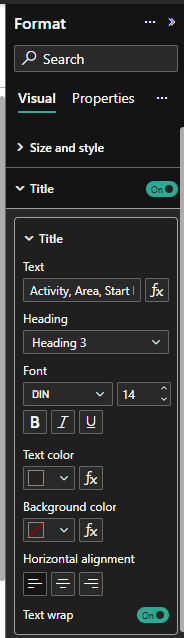

Power BI Desktop's standard built-in title. **Off by default** — declaring this object's `show` default as `false` in the visual's capabilities suppresses Power BI's auto-concatenation of data role names as the title (which is the ugly default behavior for visuals that don't declare a title object).

Turn this on to render a simple text title above the visual viewport with a single color and alignment. For richer styling (font family/size/bold/italic/underline), use **Chart Title** below instead.

### Chart Title (custom — presentation quality)

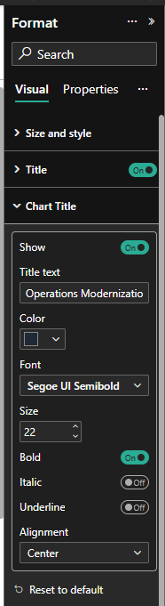

A custom in-SVG title with full styling control: **Show toggle**, **Title text**, **Color**, **Font family**, **Size**, **Bold / Italic / Underline**, **Alignment** (left / center / right). Renders inside the visual viewport so it travels with the visual when exported. Use this for PowerPoint-quality output — the demo uses **Segoe UI Semibold, 22pt, bold, #1F2937 (dark charcoal), centered**.

### Size and style (Power BI built-in)

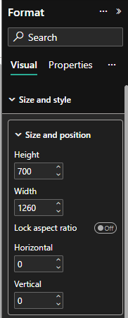

Power BI Desktop's standard visual container controls — background, border, lock aspect, padding, visual header. Not part of the Reporting Gantt code; included here for completeness so you know where to find these settings.

### Layout

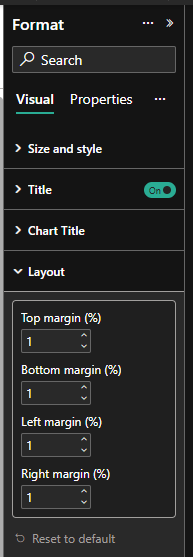

Four outer margins as percentages of the visual viewport width — Top / Bottom / Left / Right. Defaults are 1% on every side. Use this to push the chart inward from the visual container edge for breathing room.

### Swim Lanes

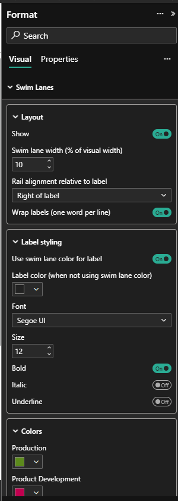

Three collapsible groups inside one card:

- **Layout** — Show toggle, swim-lane column width (% of visual), rail alignment (left / center / right of label), text wrapping.
- **Label styling** — Use swim-lane color for label (default on); custom label color; font family / size / bold / italic / underline.
- **Colors** — One color picker per slot (8 slots total). Slot 1's display name auto-binds to the first distinct Area value found in data; Slot 2 to the second; etc. Unused slots are hidden from the Format pane to keep it tidy.

### Activity Labels

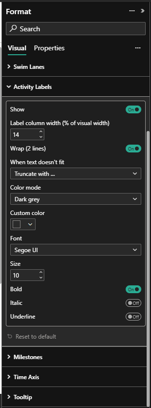

Row labels (one per activity bar). Controls: Show toggle, label column width (%), text wrap (2 lines), overflow behavior (truncate with … / hide / overflow), fill mode (dark grey or swim-lane color), custom color, full font controls. Staggered horizontal "lollipop" connectors link each label to its bar.

### Milestones

A composite card with five groups across two screenshots:

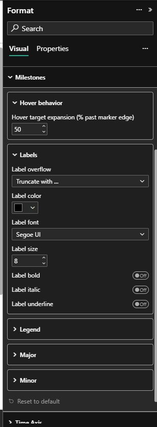

- **Hover behavior** — Hover target expansion (% beyond the marker edge); larger = easier to land tooltips on small markers.
- **Labels** — Overflow mode (truncate / hide colliding / overflow), label color, full font controls. Auto-flip on right-edge overflow is always on (viewport-correctness, not stylistic).
- **Legend** — Show toggle (default on); legend renders in the upper-left corner of the header band. Full font + color controls.

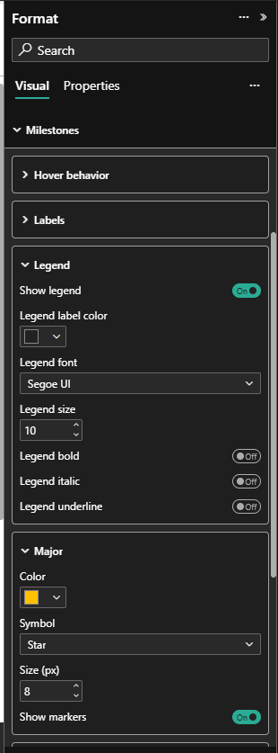

- **Type 1** and **Type 2** — Each marker type bound from data gets its own collapsible group with: **Color**, **Symbol** (star / circle / triangle / square / diamond), **Size** (pixels), **Show markers** toggle. Hiding markers compounds: a hidden marker hides its label too.

### Time Axis

A composite card with seven groups across three screenshots:

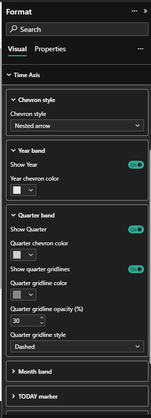

- **Chevron style** — Nested arrow / Pentagon / Rectangle.
- **Year band** — Show toggle, fill color.
- **Quarter band** — Show toggle, fill color, gridline controls (show, color, opacity, style: solid / dashed / dotted).

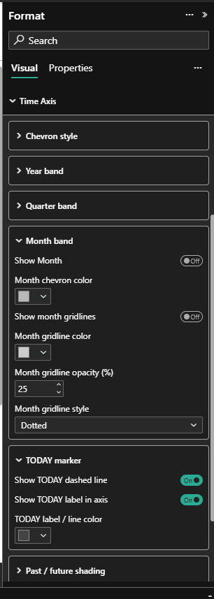

- **Month band** — Show toggle (default off), fill color, gridlines.
- **TODAY marker** — Vertical dashed line at today's date, "TODAY" label, color.
- **Past / future shading** — Tints the chart area on either side of TODAY with configurable color and opacity. Past shading on by default at 10% black; future shading off by default.

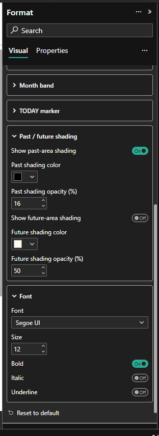

- **Font** — Family / size / bold / italic / underline. Applied to all axis labels (year / quarter / month).

### Tooltip

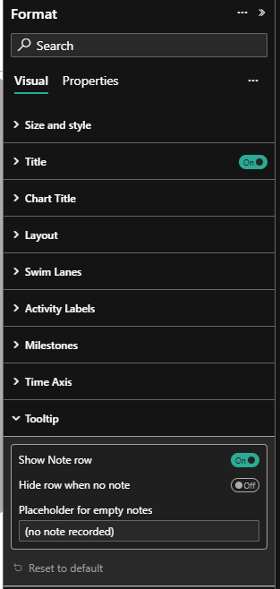

Controls hover-tooltip behavior. Three controls:

- **Show Note row** (default on) — whether the Note row appears in tooltips at all.
- **Hide row when no note** (default off) — if on, omit the Note row entirely when the bound Note column is empty/null for a row; if off, show the placeholder text instead.
- **Placeholder for empty notes** (default `(no note recorded)`) — text shown when Note row is on AND the row has no note.

## Source / dev

- TypeScript + SVG (no third-party visual code forked)
- Architectural patterns informed by reading source of MIT-licensed Microsoft visuals (`microsoft/powerbi-visuals-gantt`, `microsoft/powerbi-visuals-timeline`)
- Build: `npm run package` → `dist/<guid>.<version>.pbiviz`
- Test: drop the .pbiviz into any PBI Desktop report's `CustomVisuals/<guid>/` folder, kill PBIDesktop, relaunch — or use the bundled demo `.pbip`.

## License

MIT — see [LICENSE](LICENSE).
